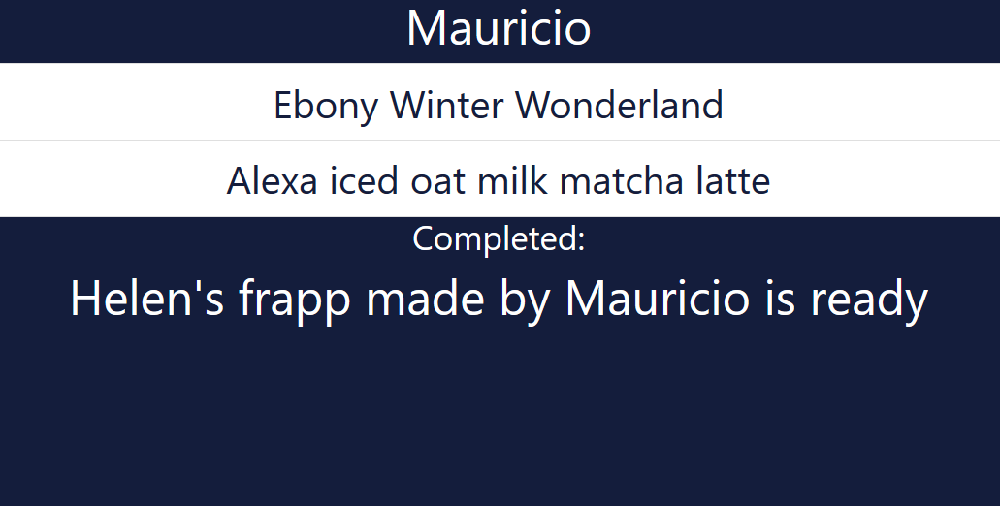

### Barista-App
## Goal: Create an application that allows a cashier to input orders and a logged in barista to cross off orders from the queue and to display which barista completed the order

# How it's accomplished:
- Server is set up to handle incoming requests using Node.js and Express
- Ejs is used to render the home page, it has fields for Login as well as fields used to input an order and the name of the person who ordered it
- When a cashier submits the order, it is treated as a post request to a queue collection
- Baristas are able to login by credentials (name and password) and a passport module is used to authenticate their login
- Once logged in, the ejs template for their profile page displays the particular users name and the entire list of items waiting to be made
- All list items are given event listeners, when they ar clicked, they are removed from the list browser side and a put request is made to the server, it takes the specific order and logs who fullfilled it
- When that request is complete, a delete request is made to the queue collection 
- Finally, the browser updates to show the name of the order that was just completed 
